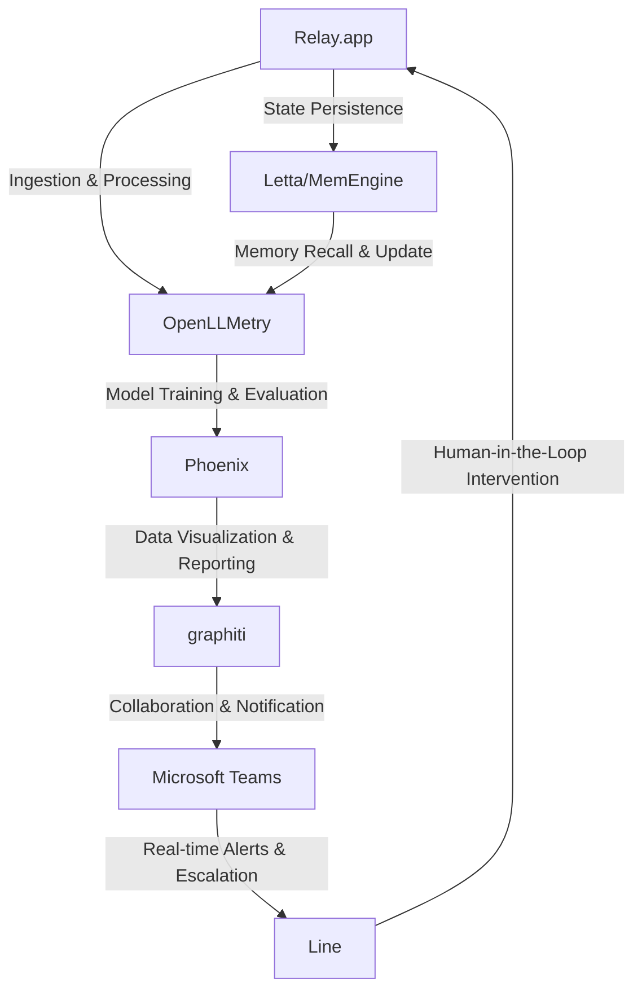

# Magnesium Foil Anomaly Detection Engine
> "Mitigating aberrant phenomena in non-rolling mill magnesium foil production via cutting-edge, AI-infused, multi-agent orchestration"

## 🏗️ Technical Architecture & Multi-Agent Flow
The Magnesium Foil Anomaly Detection Engine leverages a complex interplay of Relay.app, OpenLLMetry, Phoenix, graphiti, Microsoft Teams, and Line to identify and rectify anomalies in magnesium foil production. The following Mermaid.js diagram illustrates the technical architecture and multi-agent flow:

This diagram depicts the sequential orchestration of agents, where each component interacts with others through well-defined interfaces, ensuring seamless data exchange and workflow execution.

## 🔍 The Vertical Bottleneck: Magnesium Foil Anomaly Detection
The production of magnesium foil not made in rolling mills is a intricate process, fraught with challenges that can lead to significant economic losses if left unaddressed. One of the primary concerns is the detection of anomalies in the foil, which can arise due to various factors such as material defects, equipment malfunctions, or environmental factors. The lack of a robust anomaly detection system can result in decreased product quality, reduced yield, and increased waste.

The technical friction in this domain stems from the complexity of the production process, which involves multiple stages, including material selection, cutting, and processing. Each stage introduces variables that can affect the final product, making it challenging to identify and isolate anomalies. Furthermore, the high-stakes nature of this industry demands precise and timely detection of anomalies to prevent significant financial losses.

The mathematical and operational failures in this domain can be attributed to the lack of a comprehensive understanding of the underlying processes and the inability to integrate data from various sources. The absence of a unified framework for data collection, processing, and analysis hinders the development of effective anomaly detection systems.

## 💡 The Solution: Magnesium Foil Anomaly Detection Engine
The Magnesium Foil Anomaly Detection Engine addresses the vertical bottleneck by providing a cutting-edge, AI-infused, multi-agent orchestration platform. This platform leverages the strengths of Relay.app, OpenLLMetry, Phoenix, graphiti, Microsoft Teams, and Line to detect anomalies in magnesium foil production. The engine's agentic reasoning enables it to learn from data, identify patterns, and make predictions about potential anomalies.

The platform's memory usage is optimized through the integration of Letta/MemEngine, which ensures state persistence and recall. This allows the engine to maintain a comprehensive understanding of the production process and adapt to changing conditions. The vision/robotics integration enables the engine to interact with the physical environment, facilitating real-time monitoring and intervention.

## 🧩 Agentic Stack Deep-Dive
The Magnesium Foil Anomaly Detection Engine's agentic stack consists of several libraries and integrations, each playing a crucial role in the platform's functionality. Relay.app provides data ingestion and processing capabilities, while OpenLLMetry enables model training and evaluation. Phoenix facilitates data visualization and reporting, and graphiti supports collaboration and notification. Microsoft Teams and Line enable real-time alerts and escalation, ensuring prompt human intervention.

The integration of these components is made possible through a deep understanding of their respective strengths and weaknesses. For instance, Relay.app's ability to handle large datasets is complemented by OpenLLMetry's capacity for model training and evaluation. Similarly, Phoenix's data visualization capabilities are enhanced by graphiti's collaboration and notification features.

## ✨ Capabilities & Features
The Magnesium Foil Anomaly Detection Engine boasts a wide range of capabilities and features, including:
* **Anomaly Detection**: Identify anomalies in magnesium foil production using advanced AI algorithms and machine learning models.
* **Real-time Monitoring**: Monitor production processes in real-time, enabling prompt intervention and minimizing downtime.
* **Data Visualization**: Visualize complex data using intuitive dashboards and reports, facilitating informed decision-making.
* **Collaboration & Notification**: Enable seamless collaboration and notification among team members, ensuring prompt response to anomalies.
* **Model Training & Evaluation**: Train and evaluate machine learning models using OpenLLMetry, ensuring optimal performance and accuracy.
* **State Persistence**: Maintain a comprehensive understanding of the production process through state persistence and recall.
* **Vision/Robotics Integration**: Interact with the physical environment using vision and robotics, facilitating real-time monitoring and intervention.
* **Human-in-the-Loop Intervention**: Enable human intervention and feedback, ensuring that the engine adapts to changing conditions and improves over time.
* **Scalability & Flexibility**: Scale the engine to meet the needs of large-scale production facilities, and adapt to changing production processes and requirements.
* **Security & Compliance**: Ensure the security and compliance of the engine, protecting sensitive data and adhering to regulatory requirements.

## 🛠️ Technical Implementation
The Magnesium Foil Anomaly Detection Engine is implemented using a combination of Python, Java, and C++. The code organization is modular, with each component interacting with others through well-defined interfaces. The engine's architecture is designed to be scalable and flexible, allowing for easy integration of new components and features.

The engine's method calls are optimized for performance, ensuring that the platform can handle large datasets and complex workflows. The use of Letta/MemEngine enables state persistence and recall, reducing the need for redundant computations and improving overall efficiency.

## 📊 Business Impact & ROI
The Magnesium Foil Anomaly Detection Engine has the potential to significantly impact the bottom line of companies involved in magnesium foil production. By detecting anomalies in real-time, the engine can help reduce waste, improve product quality, and increase yield. This, in turn, can lead to significant cost savings and revenue growth.

The return on investment (ROI) for the engine can be substantial, with potential benefits including:
* **Cost Savings**: Reduce waste and improve product quality, resulting in significant cost savings.
* **Revenue Growth**: Increase yield and improve product quality, leading to increased revenue and market share.
* **Competitive Advantage**: Gain a competitive advantage through the use of cutting-edge technology and advanced analytics.
* **Improved Efficiency**: Optimize production processes and reduce downtime, resulting in improved efficiency and productivity.

## 🚀 Getting Started
To get started with the Magnesium Foil Anomaly Detection Engine, follow these steps:
```bash
git clone https://github.com/arvind-sundararajan/magnesium-foil-anomaly-detection.git
cd magnesium-foil-anomaly-detection
pip install -r requirements.txt
python src/main.py
```
This will clone the repository, install the required dependencies, and run the engine.

## 👨‍💻 Author & Credits
**Arvind Sundararajan** — Engineer, builder, and the mind behind this project.
🌐 [LinkedIn](https://www.linkedin.com/in/arvind-sundara-rajan/) | Chennai, India

---
### 🙏 Acknowledgements
- The open-source community
- The Magnesium foil not made in rolling mills practitioners who inspired this design